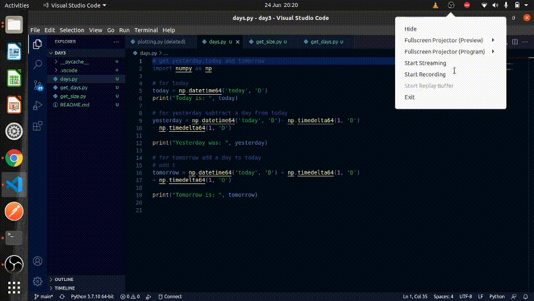

# Question 1:
```sh
Write a NumPy program to get the dates of yesterday,today and tomorrow.
```
## instalation
Install python3 and import necessary modules


First i imported numpy program which is used for arrays is javascript.
we use the datetime module from numpy to get the date and time.
for tomorrow we just add one day from the day today 
for yesterday we sabtract one day from the day today and print the output and the date is displayed as illustrated by the screen recording below.


# Question 3: 
```sh
Write a NumPy program to create an array with at least5 user input integers anddetermine the size of the memory occupied by the array.
```

First import the numpy module.
declare an empty list and assign it to a variable name.
Next prompt the user to input number of elements in their array
Aloow user to input elements and iterate through the elements till the number of elements is reached.
finally print the list and display the size of the memory occupied by the array as displayed by the screenrecording below.




## License

MIT

**Free Software, Hell Yeah!**


